name: inverse
layout: true
class: center, middle, inverse
---
layout: false
class: center, middle

# Infinite Grid Exploration   by Disoriented Robots

 
__Quentin Bramas__ (University of Strasbourg, ICUBE) 
Stéphane Devismes (Université Grenoble Alpes, VERIMAG) 
Pascal Lafourcade (University Clermont Auvergne, LIMOS) 

 
SIROCCO 2019, L'Aquilla, July 4th, 2019

 
<a href="mailto:bramas@unistra.fr">bramas@unistra.fr</a>
---
Mobile Robots:

* Move on the infinite grid
* Synchronous
* No Memory
* No Communication
* Execute the same algorithm
* Exclusive (no robots at the same position)
* May have lights with finite number of colors
* Limited Visibility
* Disoriented (but common on chirality)
---
Mobile Robots:

* Look at the nodes of the grid at distance d
* Compute a destination (Up,Left,Down,Right,Idle) based on the snapshot
* Move

Problem:

* Start with a predetermined initial configuration
* Each node of the grid should be visited by a robot in finite time.

 
 
 
 
*Emek, Y., Langner, T., Stolz, D., Uitto, J., & Wattenhofer, R. (2015). 
How many ants does it take to find the food?.*
---
## View

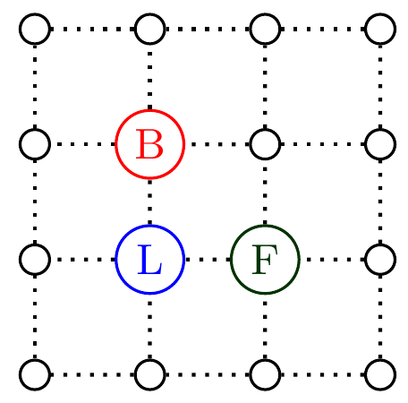

---
## View

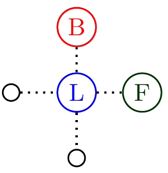

---
## View

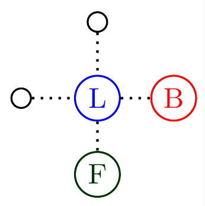

---
## Algorithm 1

* 6 robots
* lights with fixed colors (3 colors)
* visibility range = one.

<iframe style="margin:0; width:100%; border:0; height:70%" src="./6-robots-fixed-colors.html" />

---
### Rules
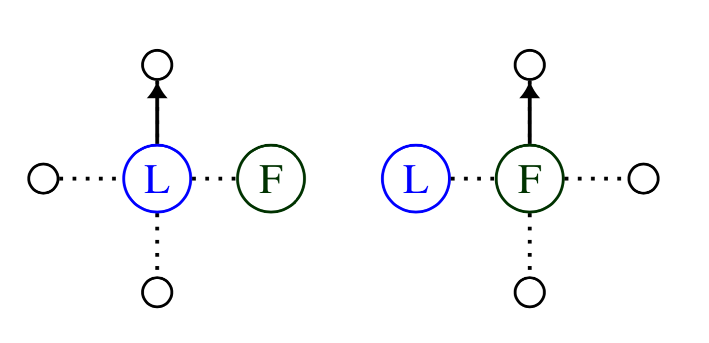

---
### Rules

### Global view
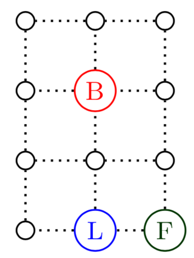

---
### Rules

### Global view
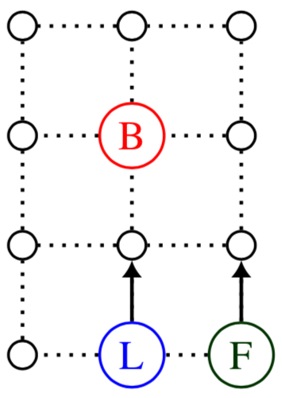

---
### Rules

### Global view

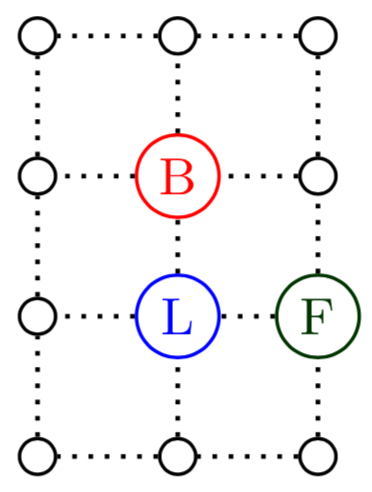

---
### Rules

### Global view

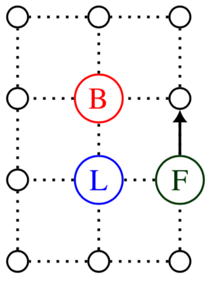

---
### Rules

### Global view

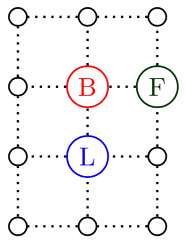

---
### Rules

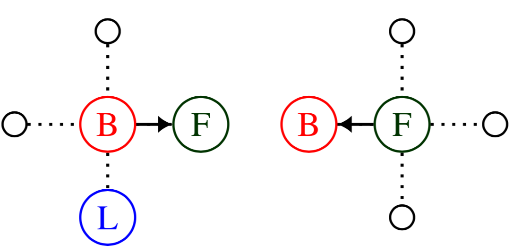
### Global view

---
### Rules

### Global view

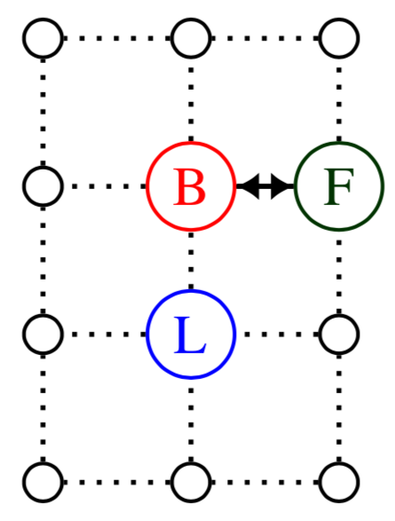

---
### Rules

### Global view

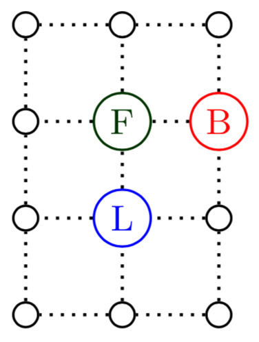
---
### Rules

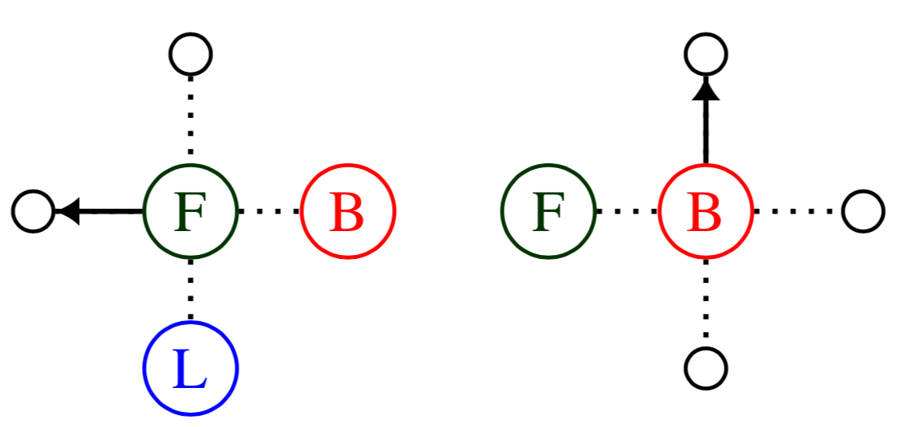
### Global view

---
### Rules

### Global view

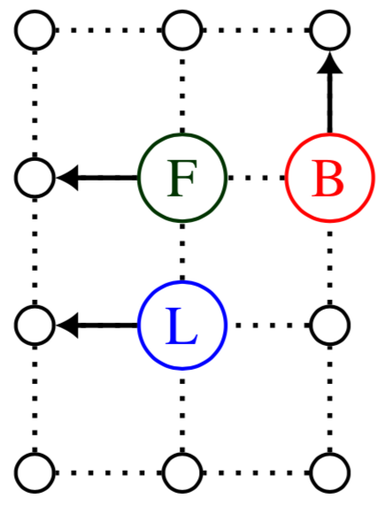

---
## Turn and Push

 → 
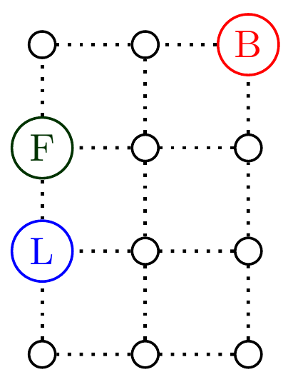
---
## Initial configuration

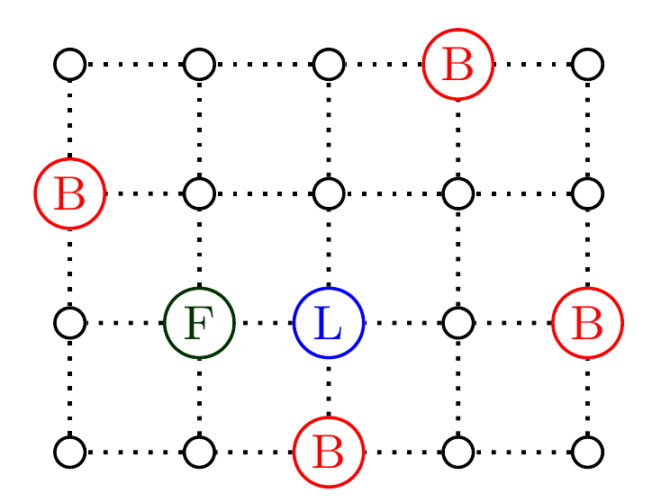

---
## Algorithm 1

* 6 robots
* lights with fixed colors (3 colors)
* visibility range = one.

<iframe style="margin:0; width:100%; border:0; height:70%" src="./6-robots-fixed-colors.html" />

---
## Impossibility Results

Theorem: Impossible with 4 robots or less.

 
 
*Bramas, Q., Devismes, S., & Lafourcade, P. (2019). 
Infinite Grid Exploration by Disoriented Robots. arXiv preprint arXiv:1905.09271.*

---
## Algorithm 2

* 5 robots (optimal)
* lights with modifiable colors (5 colors)
* visibility range = one.

<iframe style="margin:0; width:100%; border:0; height:70%" src="./5-robots-5-modifiable-colors.html" />
---

## Algorithm 3

* 7 robots
* no lights
* visibility range = two.

<iframe style="margin:0; width:100%; border:0; height:70%" src="./range2-7-robots.html" />

---

## Conclusion

Optimal infinite grid exploration with finite number of disoriented robots with limited visibility.

## Future Work

Find algorithms for robots without common chirality

Prove that **all** our algorithms are optimal

---

## Conclusion

Optimal infinite grid exploration with finite number of disoriented robots with limited visibility.

## Future Work

Find algorithms for robots without common chirality

Prove that **all** our algorithms are optimal

### Thank you

*Bramas, Q., Devismes, S., & Lafourcade, P. (2019). 
Infinite Grid Exploration by Disoriented Robots. arXiv preprint arXiv:1905.09271.*
